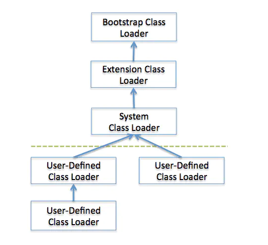

[toc]

#### 1.JRE、JDK和JVM的关系

**JDK（Java Development Kit，Java开发工具包）**是用来编译、调试Java程序的开发工具包。包括Java工具（javac/java/jdb等）和Java基础的类库（java API ）。JDK 物理存在，是 programming tools、JRE 和 JVM 的一个集合。

**JRE（Java Runtime Environment， Java运行环境）**是Java平台，所有的程序都要在JRE下才能够运行。包括JVM和Java核心类库和支持文件。

**JVM（Java Virtual Machine， Java虚拟机）**是JRE的一部分。JVM主要工作是解释自己的指令集（即字节码）并映射到本地的CPU指令集和OS的系统调用。Java语言是跨平台运行的，不同的操作系统会有不同的JVM映射规则，使之与操作系统无关，完成跨平台性。

#### 2.Java代码执行过程

- **1.编译**：将`.java`文件编译成`.class`文件，即`javac`命令，执行 `javac xxx.java`
- **2.装载字节码**：编译好的.class文件交给 JVM 执行，即使用`java`命令，执行`java xxx`（.class文件的名称，不带后缀）。`java`命令将会启动 JVM，并将后面的参数作为初始化类，通过 JVM 内的类加载器将字节码文件装载到内存中。
- **3.校验字节码**：类加载器加载完后，先由字节码校验器负责检查那些无法执行的明显有破坏性的操作。除了系统类之外，其他类都要被校验。
- **4.解释字节码**：JVM 把每一条要执行的字节码交给解释器，翻译成对应的**机器语言**，最终由操作系统执行。
- **5.执行**

#### 3.**JVM类加载顺序**

- Booststrap ClassLoader（引导类加载器）JVM启动时初始化此ClassLoader，并由此完成$JAVA_HONE中jre/lib/rt.jar（Sun JDK的实现）中所有class文件的加载，这个jar中包含了java规范定义的所有接口以及实现。
- Extension ClassLoader（扩展）加载扩展功能的一些jar包
- System ClassLoader（）JVM用此ClassLoader来加载启动参数中指定的ClassPath中的jar包以及目录，在Sun JDK中ClassLoader对应的类名为AppClassLoader。
- User-Defined ClassLoader（自定义类加载器）Java开发人员继承ClassLoader抽象类实现的ClassLoader，基于自定义的ClassLoader可用于加载非ClassPath中的jar以及目录。