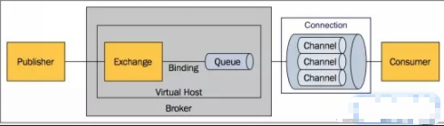

# RabbitMQ

[toc]

##### 简介

> RabbitMQ是一个实现了AMQP（Advanced Message Queuing Protocol）高级消息队列协议的消息队列服务，用Erlang语言开发。

#### 队列（queue）的概念

> 队列是一种特殊的线性表，特殊之处在于它只允许在表的前端（front）进行删除操作，而在表的后端（rear）进行插入操作，和栈一样，队列是一种操作受限制的线性表。进行插入操作的端称为队尾，进行删除操作的端称为队头。队列中没有元素时，称为空队列。
>
> 队列的数据元素又称为队列元素。在队列中插入一个队列元素称为入队，从队列中删除一个队列元素称为出队。因为队列只允许在一端插入，在另一端删除，所以只有最早进入队列的元素才能最先从队列中删除，故队列又称为先进先出（FIFO—first in first out）线性表。

#### 消息队列

> 服务之间最常见的通信方式是直接调用彼此来通信，消息从一端发出后==立即==就可以达到另一端，称为==即时消息通讯==（同步通信)；
> 消息从某一端发出后，首先进入一个容器进行临时存储，==当达到某种条件后==，再由这个容器发送给另一端，称为==延迟消息通讯== （异步通信）

#### 原理

###### Producer 生产者

> 将消息Message 发送给Broker Server，
>
> Message 一般有两部分，payload和label，通过lable来找到指定的消费者，payload为消息体。

###### Exchange 交换机

>接收消息，按照路由规则将消息路由到一个或者多个队列。如果路由不到，或者返回给生产者，或者直接丢弃。RabbitMQ常用的交换器常用类型有direct、topic、fanout、headers四种

###### routing-key

>生产者不能将消息直接发到queues，需要先发送到exchanges。routing-key用来指定queues名称，exchanges通过routing-key来识别与之绑定的queues，然后将消息发送到指定的队列

###### binding 绑定

>
>
>

###### Queue 队列

>rabbitmq内部对象，用于存储消息
>
>Queue 必须存在才能正常收发消息，所以 Consumer 消费者 和 Producer 都会尝试创建queue

###### Connection 链接

> TCP的连接，Producer和Consumer都是通过TCP连接到RabbitMQ Server
>
> 应用程序的生产者、消费者与rabbitMQ 服务进行网络连接，TCP链接

###### Channel	信道

>信道，消息读写等操作在信道中进行。客户端可以建立多个信道，每个信道代表一个会话任务。
>
>

###### Consumer 消费者

>
>
>

###### Broker Rabbit 服务

###### Virtual host：虚拟主机

>当多个不同的用户使用同一个RabbitMQ server提供的服务时，可以划分出多个vhost，每个用户在自己的vhost创建exchange／queue
>
>一个broker里可以开设多个vhost,vhost之间是也完全隔离的.
>
>用于逻辑隔离。一个虚拟主机里面可以有若干个Exchange和Queue，同一个虚拟主机里面不能有相同名称的Exchange或Queue。