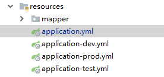

[toc]

### SpringApplication

- ###### springboot的起点main方法。


```java
@SpringBootApplication
public class SpringBootLearnApplication {
    
	public static void main(String[] args) {
   		SpringApplication.run(SpringBootLearnApplication.class, args);
	}
    
}
```

- ###### run方法

```java
	public static ConfigurableApplicationContext run(Class<?> primarySource, String... args) {
		return run(new Class<?>[] { primarySource }, args);
	}


```

| 参数                           | 类型      | 作用                                                         |
| ------------------------------ | --------- | ------------------------------------------------------------ |
| primarySource                  | Class<?>  | main方法所在的类，该类后续将被作为主要的资源来使用，比如获取到该类的类路径 |
| args                           | String... | main方法的命令行参数，命令行参数可以通过main传入，也就意味着可以在springboot启动的时候设置对应的参数，比如当前是dev环境、还是production环境等 |
| ConfigurableApplicationContext |           | spring容器                                                   |

- ###### 第二层run方法

```java
	public static ConfigurableApplicationContext run(Class<?>[] primarySources, String[] args) {
		return new SpringApplication(primarySources).run(args);
	}
```

构造了一个SpringApplication实例对象，而后调用了SpringApplication的成员方法run

- ###### SpringApplication构造函数

```java
public SpringApplication(Class<?>... primarySources) {
		this(null, primarySources);
}

// 

public SpringApplication(ResourceLoader resourceLoader, Class<?>... primarySources) {
    // 设置资源加载器
    this.resourceLoader = resourceLoader;
    
    Assert.notNull(primarySources, "PrimarySources must not be null");
    
    // 设置主要资源类
    this.primarySources = new LinkedHashSet<>(Arrays.asList(primarySources));
    
    // 推断当前应用的类型
    this.webApplicationType = WebApplicationType.deduceFromClasspath();
    
    // 设置ApplicationContext的初始化器
    setInitializers((Collection) getSpringFactoriesInstances(ApplicationContextInitializer.class));
    
    // 设置Application监听器
    setListeners((Collection) getSpringFactoriesInstances(ApplicationListener.class));
    
    // 推断并设置主类
    this.mainApplicationClass = deduceMainApplicationClass();
}
```

1. webApplicationType，会根据类路径是否包含指定的类判断项目类型，从而启动web容器。

2. ApplicationContextInitializer，从META-INF/spring.factories配置文件中找到所有ApplicationContextInitializer接口对应的实现类配置，然后通过反射机制构造出对应的实例对象。

3. ApplicationListener，同上

4. 获取当前main方法所在的class

   ```java
   private Class<?> deduceMainApplicationClass() {
       try {
           
           // 获取堆栈链路
           StackTraceElement[] stackTrace = new RuntimeException().getStackTrace();
           
           // 遍历每一个栈帧信息
           for (StackTraceElement stackTraceElement : stackTrace) {
               
               // 如果该栈帧对应的方法名等于main
               if ("main".equals(stackTraceElement.getMethodName())) {
                   
                   // 获取该类的class对象
                   return Class.forName(stackTraceElement.getClassName());
               }
           }
       }
       catch (ClassNotFoundException ex) {
           // Swallow and continue
       }
       return null;
   }
   ```


- ###### 成员的run方法（主要为了创建并配置好一个`ApplicationContext`）

```java
public ConfigurableApplicationContext run(String... args) {
    StopWatch stopWatch = new StopWatch();
    stopWatch.start();
    
    // 声明一个Context容器
    ConfigurableApplicationContext context = null;
    Collection<SpringBootExceptionReporter> exceptionReporters = new ArrayList<>();
    configureHeadlessProperty();
    
    // 获取监听器
    SpringApplicationRunListeners listeners = getRunListeners(args);
    
    // 开始监听
    listeners.starting();
    try {
        ApplicationArguments applicationArguments = new DefaultApplicationArguments(args);
        
        // 创建并配置Environment（这个过程会加载application配置文件）
        ConfigurableEnvironment environment = prepareEnvironment(listeners, applicationArguments);
        configureIgnoreBeanInfo(environment);
        Banner printedBanner = printBanner(environment);
        
        // 根据应用类型创建对应的Context容器
        context = createApplicationContext();
        exceptionReporters = getSpringFactoriesInstances(SpringBootExceptionReporter.class,
                                                         new Class[] { ConfigurableApplicationContext.class }, context);
        
        // 刷新Context容器之前的准备
        prepareContext(context, environment, listeners, applicationArguments, printedBanner);
        
        // 刷新Context容器
        refreshContext(context);
        
        // 刷新Context容器之后处理
        afterRefresh(context, applicationArguments);
        stopWatch.stop();
        if (this.logStartupInfo) {
            new StartupInfoLogger(this.mainApplicationClass).logStarted(getApplicationLog(), stopWatch);
        }
        
        // Context容器refresh完毕发布
        listeners.started(context);
        
        // 触发Context容器refresh完以后的执行
        callRunners(context, applicationArguments);
    }
    catch (Throwable ex) {
        handleRunFailure(context, ex, exceptionReporters, listeners);
        throw new IllegalStateException(ex);
    }

    try {
        // Context启动完毕，Runner运行完毕发布
        listeners.running(context);
    }
    catch (Throwable ex) {
        handleRunFailure(context, ex, exceptionReporters, null);
        throw new IllegalStateException(ex);
    }
    return context;
}
```


### spring.factories配置文件的工厂模式

`META-INF/spring.factories`文件

- 其中都是键值对 key = value 格式
- key声明的是一个接口，value则是这个接口对应的实现类，如果有多个则以","符号分割

```properties
# PropertySource Loaders
org.springframework.boot.env.PropertySourceLoader=\
org.springframework.boot.env.PropertiesPropertySourceLoader,\
org.springframework.boot.env.YamlPropertySourceLoader

# Run Listeners
org.springframework.boot.SpringApplicationRunListener=\
org.springframework.boot.context.event.EventPublishingRunListener
```

- 获取Bean对象的Collection


```java
// 使用
// getSpringFactoriesInstances(ApplicationListener.class));

private <T> Collection<T> getSpringFactoriesInstances(Class<T> type) {
    return getSpringFactoriesInstances(type, new Class<?>[] {});
}
```

- 具体方法

```java
private <T> Collection<T> getSpringFactoriesInstances(Class<T> type, Class<?>[] parameterTypes, Object... args) {
    
    // 1. 类加载器 
    ClassLoader classLoader = getClassLoader();
    
    // 2. 加载 META-INF/spring.factories 文件的类路径到Set<String>，不可重复
    // Use names and ensure unique to protect against duplicates
    Set<String> names = new LinkedHashSet<>(SpringFactoriesLoader.loadFactoryNames(type, classLoader));
    
    // 3. 反射创建Bean
    List<T> instances = createSpringFactoriesInstances(type, parameterTypes, classLoader, args, names);
    
    // 4. 
    AnnotationAwareOrderComparator.sort(instances);
    return instances;
}
```

###### 1.

```

```

###### 2.加载 `META-INF/spring.factories` 文件的类路径到`Set<String>`

```java
public static List<String> loadFactoryNames(Class<?> factoryClass, @Nullable ClassLoader classLoader) {
    String factoryClassName = factoryClass.getName();
    return loadSpringFactories(classLoader).getOrDefault(factoryClassName, Collections.emptyList());
}


private static Map<String, List<String>> loadSpringFactories(@Nullable ClassLoader classLoader) {
    
    // 读取缓存
    MultiValueMap<String, String> result = cache.get(classLoader);
    if (result != null) {
        return result;
    }

    // 读取配置文件中的配置，
    try {
        // 获取所有spring.factories的URL
        Enumeration<URL> urls = (classLoader != null ?
                                 classLoader.getResources(FACTORIES_RESOURCE_LOCATION) :
                                 ClassLoader.getSystemResources(FACTORIES_RESOURCE_LOCATION));
        result = new LinkedMultiValueMap<>();
        while (urls.hasMoreElements()) {
            URL url = urls.nextElement();
            UrlResource resource = new UrlResource(url);
            Properties properties = PropertiesLoaderUtils.loadProperties(resource);
            for (Map.Entry<?, ?> entry : properties.entrySet()) {
                String factoryClassName = ((String) entry.getKey()).trim();
                for (String factoryName : StringUtils.commaDelimitedListToStringArray((String) entry.getValue())) {
                    result.add(factoryClassName, factoryName.trim());
                }
            }
        }
        cache.put(classLoader, result);
        return result;
    }
    catch (IOException ex) {
        throw new IllegalArgumentException("Unable to load factories from location [" +
                                           FACTORIES_RESOURCE_LOCATION + "]", ex);
    }
}
```

###### 3.反射创建Bean

```java
	private <T> List<T> createSpringFactoriesInstances(Class<T> type, Class<?>[] parameterTypes,
			ClassLoader classLoader, Object[] args, Set<String> names) {
		List<T> instances = new ArrayList<>(names.size());
        
        // 遍历实例对象的全限定名
		for (String name : names) {
			try {
                
                // 加载该类
				Class<?> instanceClass = ClassUtils.forName(name, classLoader);
                
                // 断言是否为该接口的实现类
				Assert.isAssignable(type, instanceClass);
                
                // 获取构造方法
				Constructor<?> constructor = instanceClass.getDeclaredConstructor(parameterTypes);
                
                // 实例化该类
				T instance = (T) BeanUtils.instantiateClass(constructor, args);
                
                //添加到结果集当中
				instances.add(instance);
			}
			catch (Throwable ex) {
				throw new IllegalArgumentException("Cannot instantiate " + type + " : " + name, ex);
			}
		}
		return instances;
	}
```


### Environment

- `application.properties`中的内容是程序启动之后动态读取的，与应用程序是解耦的。

- springboot 启动时，SpringApplication从以下位置加载配置文件，
  - 当前目录的/config子目录
  - 当前目录
  - classpath下的/config目录
  - classpath路径根目录
    - 将`properties`中的键值对放到 Environment 中，
    - 后加载的属性会覆盖先加载的属性


##### 简介

Environment用来表示整个应用运行时的环境，为了更形象地理解Environment，你可以把Spring应用的运行时简单地想象成两个部分：一个是Spring应用本身，一个是Spring应用所处的环境Environment。

Environment为我们的Spring应用程序环境的两个方面的支持：profiles and properties。

#### 1.profile

profile的作用就是符合这个给定profile配置的bean的集合。

在定义bean之后，会给bean指定profile，只有当profile处于active状态时，才会被创建。


###### profile的使用

- 最简单的方式切换配置文件
- 通过profile指定要加载的配置文件

```xml
// 例如
<beans profile="test">
	<context:property-placeholder location="/WEB-INF/test.properties" />
</beans>
 
<beans profile="beta">
	<context:property-placeholder location="/WEB-INF/beta.properties" />
</beans>

```




###### 激活指定profile方式

- spring.profiles.active
- spring.profiles.default

如果自己不指定，那么会使用`spring.profiles.default`

1.代码方式

```java
AnnotationConfigApplicationContext ctx = new AnnotationConfigApplicationContext();
ctx.getEnvironment().setActiveProfiles("development");
ctx.refresh();
```

2.配置文件指定

```xml

<init-param>
  <param-name>spring.profiles.active</param-name>
  <param-value>beta</param-value>
</init-param>
```

```yml
spring:
  #环境 dev|test|prod
  profiles:
    active: test
```

3.Tomcat启动参数指定

```
JAVA_OPTS="-Dspring.profiles.active=test"
```


#### 2.properties