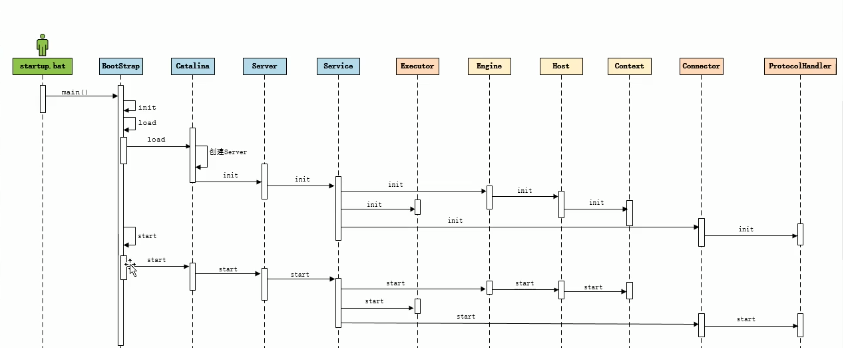
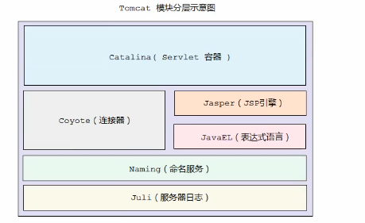
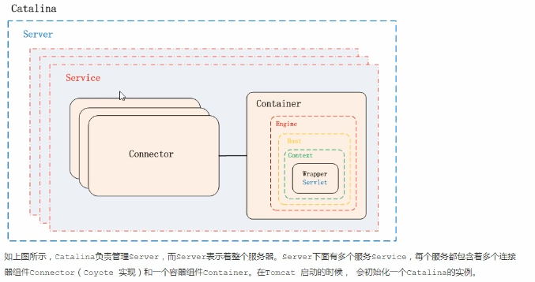
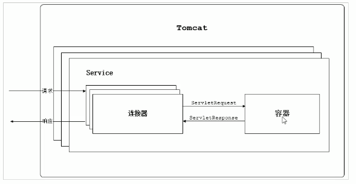
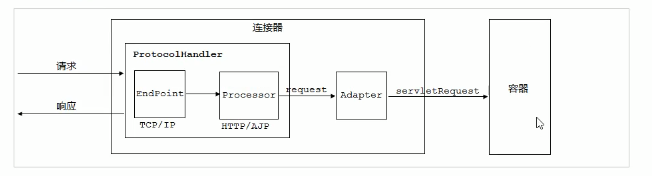
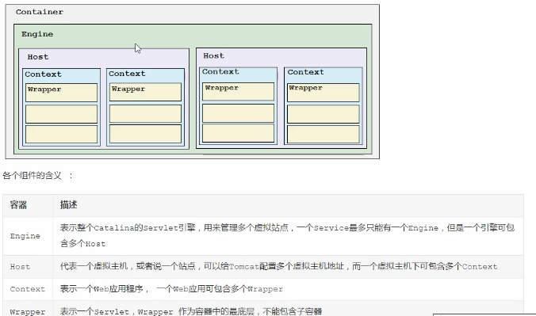

# tomcat

#### 1.目录

- **bin**：可以执行文件。
  - (startup.bat/startup.sh,shutdown.bat/shutdown.sh 启动停止命令)
- **conf**：tomcat服务器的配置文件
  - logging.properties：日志配置文件
  - server.xml：tomcat基本配置信息
  - tomcat-users.xml：角色用户配置
  - web.xml：应用部署的配置文件
- **lib**：tomcat启动后需要依赖的jar包
- **logs**：tomcat工作之后的日志文件
- **webapps**：是tomcat布暑工程的目录。
- **work**：jsp文件在被翻译之后，保存在当前这个目录下，session对象被序列化之后保存的位置


#### 2.启动

启动流程：



加载配置文件，监听指定端口号

```json
1. 双击/bin/startup.bat
2. 在命令行安装目录bin下，执行catalina run，会提示启动信息。
3. 默认端口 8080
```
```java
// 启动的main方法 Bootstrap.class下
// package org.apache.catalina.startup

public static void main(String[] args) {
        synchronized(daemonLock) {
            if (daemon == null) {
                Bootstrap bootstrap = new Bootstrap();

                try {
                    bootstrap.init();
                } catch (Throwable var5) {
                    handleThrowable(var5);
                    var5.printStackTrace();
                    return;
                }

                daemon = bootstrap;
            } else {
                Thread.currentThread().setContextClassLoader(daemon.catalinaLoader);
            }
        }

        try {
            String command = "start";
            if (args.length > 0) {
                command = args[args.length - 1];
            }

            if (command.equals("startd")) {
                args[args.length - 1] = "start";
                daemon.load(args);
                daemon.start();
            } else if (command.equals("stopd")) {
                args[args.length - 1] = "stop";
                daemon.stop();
            } else if (command.equals("start")) {
                daemon.setAwait(true);
                daemon.load(args);
                daemon.start();
                if (null == daemon.getServer()) {
                    System.exit(1);
                }
            } else if (command.equals("stop")) {
                daemon.stopServer(args);
            } else if (command.equals("configtest")) {
                daemon.load(args);
                if (null == daemon.getServer()) {
                    System.exit(1);
                }

                System.exit(0);
            } else {
                log.warn("Bootstrap: command \"" + command + "\" does not exist.");
            }
        } catch (Throwable var7) {
            Throwable t = var7;
            if (var7 instanceof InvocationTargetException && var7.getCause() != null) {
                t = var7.getCause();
            }

            handleThrowable(t);
            t.printStackTrace();
            System.exit(1);
        }

    }
```


#### 3.tomcat 架构



###### Catalina

tomcat的servlet容器。






- 连接器：接收发送socket 请求
- 容器：加载管理servlet，处理请求（**一个容器对应多个连接器**）
- 连接器+容器组成service


###### 1.连接器（Connector）：

Coyote



- endpoint：接收socket请求，处理tcp/ip请求，转发给processor
- processor：将请求数据转换为request对象
- protocolHandler=endpoint+processor
- Adapter：通过适配器模式转换request对象为servletRequest对象


连接器分为两部分：

1.处理i/o模型和底层协议

- 传输层
  - nio模型（默认）：非堵塞i/o，基于java nio类库
  - nio2模型：基于 jdk7之后的nio2类库
  - APR模型：采用apache可移植库进行实现
- 应用层
  - HTTP/1.1:大部分web应用采取的访问协议
  - AJP协议：用于和web服务器集成，以实现对静态资源的优化和集群部署
  - HTTP/2: 大幅度提升了web性能，tomcat8.5之后支持

2.将请求数据转换为servletRequest


###### 2.容器（Container）

Tomcat有4种容器，他们是父子关系




#### 4.请求处理流程

###### 1.路径流程

`localhost8080/app/findAll`

- `localhost`主机ip。
- `8080` tomcat端口号。
- 通过前`localhost8080`找到tomcat服务
- tomcat默认启动一个`Catalina`服务器，它包括两部分，`Connector`连接器和`Container`容器。
- `Connector`连接器将HTTP请求数据转换为servletRequest对象。
- `Catalina`中有一个`Engine`，`Engine`对应主机ip`localhost`。
- `Engine`中有多个`Host`，指定部署服务的文件路径，路径中有项目名称`app`。
- `app`中解析出servlet并执行


版本 tomcat 依赖于java版本，64与32混用会报错

5. 端口修改

        conf/server.xml 中
        
        <Connector port="8080" protocol="HTTP/1.1"
           connectionTimeout="20000"
           redirectPort="8443" />
           
        此处修改端口 
    
6. 部署项目

        1. jsp+servlet项目
            在conf/server.xml中的host内配置
            <Context  path="/atguigu"  docBase="D:\atguigu"/>
            <Context  path=”浏览器要访问的目录---虚拟目录”  docBase=”网站所在磁盘目录”/>
            
        2. 将文件放在webapps目录下，名称为访问的目录
            相当于前面的指定了 名称和位置
            
        3. 将项目打成war包放在webapps目录下，名称为项目名。
        
        4. 直接通过ip+端口访问的是/webapps/ROOT目录项目，如果有一个叫ROOT的项目，则直接通过ip+端口访问


7. xml 解析  优先级：.m2文件下为局部配置>conf文件下的全局配置

        1. localRepository  配置本地仓库
          默认：${user.home}  指的是 user/用户名/  
          <localRepository>${user.home}/.m2/repository</localRepository>
          修改：
          <localRepository>D:\maven-repository\repository</localRepository>
          
        2. 


```
日志打印乱码，在conf/logging.properties中，更改显示编码为本地电脑显示编码
java.util.logging.ConsoleHandler.encoding = UTF-8
修改为
java.util.logging.ConsoleHandler.encoding = GBK
```

