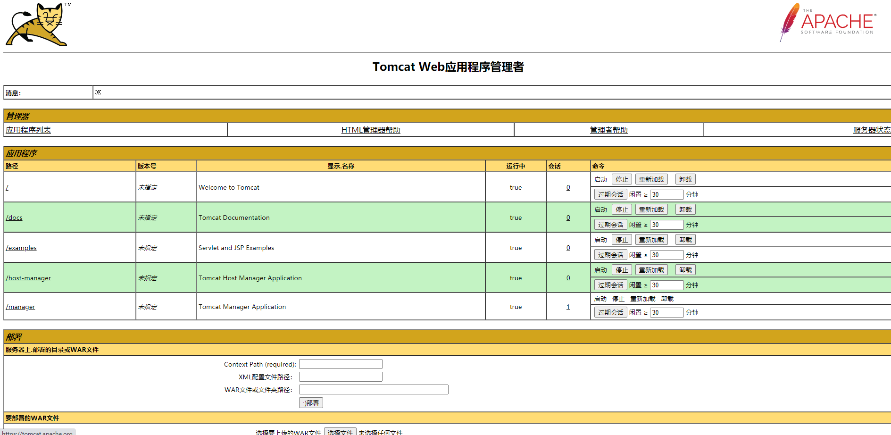

[toc]


> tomcat 提供了 Web 版的管理控制台，manager 和 host-manager。
>
> host-manager 用于管理 host。
>
> manager 用于管理 web 应用


### host-manager 

http://localhost:8080/host-manager/html

该 web 项目为 `webapps/host-manager`

该 web 项目的用户和角色在 `/conf/tomcat-users.xml` 中配置，默认没有配置，此服务无法登录

```xml
  
// 角色
<role rolename="tomcat"/>

// 用户
<user username="tomcat" password="admin" roles="tomcat"/>


<role rolename="tomcat"/>
<role rolename="admin-gui"/>
<role rolename="admin-script"/>


<user username="admin" password="admin" roles="tomcat,admin-gui,admin-script"/>
```


### manager 

http://localhost:8080/manager/html

该 web 项目为 `webapps/manager`

管理部署在当前 tomcat 中的 web 应用

该 web 项目的用户和角色在 `/conf/tomcat-users.xml` 中配置，默认没有配置，此服务无法登录

```xml
<role rolename="manager-gui"/>
<role rolename="manager-script"/>


<user username="admin" password="admin" roles="manager-gui,manager-script"/>

```



##### **右上角服务器状态**

监视服务器详细信息

- OS: 物理主机信息
- JVM：jvm内存信息
  - Heap memory：  堆内存
  - Non-heap memory：非堆内存
- http-nio-8080: 线程池信息


### JVM 配置

##### 内存模型


##### 配置参数

jvm 参数在 tomcat 启动时配置

- windows： catalina.bat 文件
  - `set JAVA_OPTS=-server -Xms2048m -Xmx:2048m -XX:XX:MetaspaceSize=256m -XX:MaxMetaspaceSize=256m -XX:SurvivorRatio=8`
- linux：catalina.sh 文件
  - `JAVA_OPTS=-server -Xms2048m -Xmx:2048m -XX:XX:MetaspaceSize=256m -XX:MaxMetaspaceSize=256m -XX:SurvivorRatio=8`

| 参数                                                   | 含义                              |
| ------------------------------------------------------ | --------------------------------- |
| -Xms                                                   | 堆内存初始大小                    |
| -Xmx                                                   | 最小堆内存                        |
| -Xmn                                                   | 新生代内存大小，建议是堆内存的1/3 |
| -XX:MetaspaceSize                                      | 元空间内存初始大小                |
| -XX:MaxMetaspaceSize                                   | 元空间内存最大大小                |
| -XX:InitialCodeCacheSize<br/>-XX:ReservedCodeCacheSize | 代码缓存区大小                    |
| -XX:NewRatio                                           | 新生代与老年代内存配比            |
| -XX:SurvivorRatio                                      |                                   |

