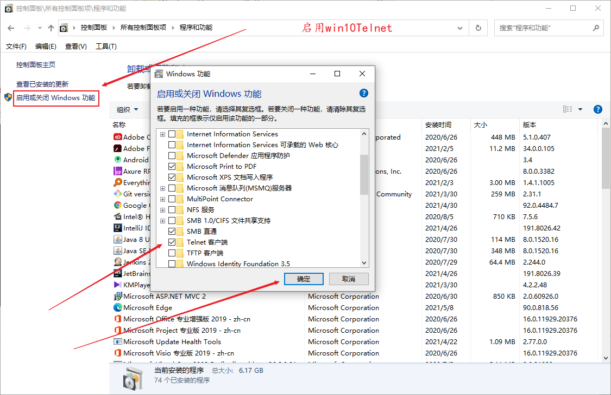

## 集群问题

##### 方法

客户端访问 nginx，nginx 反向代理将请求转发到指定tomcat

nginx.conf 配置server，反向代理到tomcat

```conf
upstream serverpool {
	server localhost:8888;
	server localhost:9999;
}

server {
	listen	99;
	server_name	localhost;
	
	location / {
		proxy_pass	http://serverpool/;
	}
}
```


###### 负载均衡策略

1. 默认轮询
2. 添加weight 权重
3. ip_hash （根据请求ip算出hash，这样来转发到指定服务器）


#### Session 共享问题

tomcat 集群中，用户登录只能登录一个服务器，另一台服务器不会知道是否登录，假如请求第二台服务器，还需要登录。

##### 解决

###### ip_hash 

使用 nginx 的 ip_hash 负载均衡策略，每一个请求 ip 都会经过 hash 算法转发到一个服务器，这样一个 ip 就会只能访问一台服务器，session 就不是问题了 


###### session 复制

使用`DeltaManager`复制会话增量的全部会话复制。从全部到全部，我们的意思是*每个* 会话都被复制到集群中的*所有其他节点*。这对于较小的群集非常有用，但是我们不建议对较大的群集（大约4个以上的节点）使用它。另外，在使用`DeltaManager`时，Tomcat会将会话复制到*所有*节点， *甚至没有部署应用程序的节点*。

通过广播的方式复制 session， 会消耗大量带宽

server.xml 中,使用被注释掉的内容

```xml
<Engine>
    // TCP 方式向其他集群复制 session 信息
	<Cluster className="org.apache.catalina.ha.tcp.SimpleTcpCluster"/>
</Engine>
```

项目的 web.xml 添加  `<distributable/>` 标签

```xml
<distributable/>
```

###### SSO-单点登录


## 安全问题

#### 配置安全

**禁止使用 tomcat 管理页面**

1. 删除 webapps 目录下所有文件，禁用 tomcat 管理页面。

2. 注释或者删除 tomcat-users.xml 文件内所有用户与权限。

3. 更改或者禁用 tomcat 关闭指令。

   1. ```xml
      // 这里接收到 port = 8005 的 SHUTDOWN 指令，则会关闭 tomcat
      <Server port="8005" shutdown="SHUTDOWN"></Server>    
      
      // 关闭方法  win + r +cmd
      telnet 127.0.0.1 8005
      SHUTDOWN
      会关闭tomcat
      
      // 禁用方法  port 改为 -1
      <Server port="-1" shutdown="SHUTDOWN"></Server>   
      ```

4. 定义错误页面，防止用户看到异常信息。

###### 启用win10 telnet




####  应用安全

##### 权限安全

登录系统与权限管控

#### 传输安全

HTTPS 协议